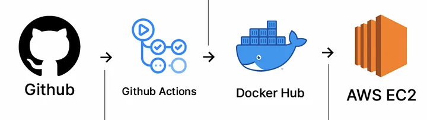

# 📋 JWT Validator Application Documentation

## Sobre a Aplicação

Aplicação consiste na validação de tokens JWT (JSON Web Tokens). O serviço verifica a estrutura do token e suas claims, assegurando que atendem a critérios específicos de validação.

## Por dentro da Aplicação 

### Pré-requisitos

* Java 21 ou superior
* Maven 3.9.9 ou superior
* Git

### Passos para Execução

1. **Clonar o repositório:**

    ```bash
    git clone https://github.com/igorliveira/backend-challenge
    cd backend-challenge
    ```

2. **Compilar o projeto:**

    ```bash
    mvn clean install
    ```

3. **Executar a aplicação:**

    ```bash
    mvn spring-boot:run
    ```

4. **Executar os testes:**

   Para executar os testes unitários/integração, utilize:

    ```bash
    mvn test
    ```

### Descrição das Classes e Métodos

### [`JwtValidatorController`](src/main/java/com/tokenvalidator/app/services/TokenService.java)

Nosso controlador REST qual recebe as requisições HTTP e realiza as primeira validações do token e chama nosso Service para as validações principais.

#### `validate(String jwtToken)`

Este método recebe um token JWT como corpo da solicitação HTTP e o valida usando o serviço JwtServiceIpml. Se o token for nulo ele retorna `false` sem chamar nosso Service.

### [`JwtValidatorService`](src/main/java/com/tokenvalidator/app/services/TokenService.java)

Nosso service qual tem rensposabilidade de validar o JWT e as regras para cada uma de suas claims.

#### `validateJwt(String jwt)`

Este é o método principal do nosso Service qual decodifica nosso token JWT, valida seu payload e chama nosso validator principal o ClaimValidator.

#### `decodeJwt(String jwt)`

Este método decodifica nosso token JWT que é um base64 e separa nosso payload qual possui nossas claims e retorna para o metodo principal do Service.

#### `isValidJson(String jwt)`

Este método valida nosso payload, transformando ele em um JSON e garantido que nosso payload é um JSON.

### [`ClaimValidator`](src/main/java/com/tokenvalidator/app/services/TokenService.java)

Nosso Validator qual tem rensposabilidade de validar o JWT e chamar os validators para cada claim.

#### `validate(Map<String, String> map)`

Este é o método principal do nosso ClaimValidator responsável por validar as claims recebidas em nossos payload se são Name, Role e Seed. E chamar nossos validators especificos para cada claim.

#### `validateKeys(Map<String, String> map)`

Este método valida se possuimos as 3 keys obrigatórias do payload do nosso JWT.

### [`NameValidator`](src/main/java/com/tokenvalidator/app/services/TokenService.java)

Nosso validator que verifica se nosso Name atende os requisitos solicitados.

#### `validate(String name)`

Metódo qual valida se a claim Name possui até 256 caracteres e nenhum número.

### [`RoleValidator`](src/main/java/com/tokenvalidator/app/services/TokenService.java)

Validator que verifica a claim Role.

#### `validate(String name)`

Método que verifica se a Role recebida é valida, podendo ser `Admin`, `Member` ou `External`.

### [`SeedValidator`](src/main/java/com/tokenvalidator/app/services/TokenService.java)

Validator que verifica a claim Seed.

#### `validate(String name)`

Método que verifica se o Seed não é um número Primo.

 Descrição dos Testes

Realizamos testes abrangentes em todas as nossas classes, considerando os quatro cenários descritos na instrução do projeto, além de cenários adicionais. Nosso objetivo é garantir uma validação completa, cobrindo todo o projeto de ponta a ponta. Asseguramos que todos os métodos estão 100% funcionais conforme o esperado e que qualquer falha.

### Classes utilizadas nos Testes

#### [`JwtValidatorControllerTest`](src/main/java/com/tokenvalidator/app/services/TokenService.java)

#### [`JwtValidatorServiceTest`](src/main/java/com/tokenvalidator/app/services/TokenService.java)

#### [`ClaimValidatorTest`](src/main/java/com/tokenvalidator/app/services/TokenService.java)

#### [`NameValidatorTest`](src/main/java/com/tokenvalidator/app/services/TokenService.java)

#### [`RoleValidatorTest`](src/main/java/com/tokenvalidator/app/services/TokenService.java)

#### [`SeedValidatorTest`](src/main/java/com/tokenvalidator/app/services/TokenService.java)

## Por dentro da Infraestrutura 

### Pré-requisitos

* Docker 
* Helm 
* Terraform
* Distribuição Kubernetes (microk8s)

### Containerização da aplicação

### [`Dockerfile`](src/main/java/com/tokenvalidator/app/services/TokenService.java)

Para containerizar a aplicação, é necessário ter o Docker instalado na máquina. Além disso, devemos criar um script semelhante ao que já temos na raiz do projeto. Com isso, podemos realizar o build da aplicação, gerando uma imagem Docker que será utilizada no nosso container.

Importante ressaltar que utilizamos em nosso script uma jre, pois como apenas vão executar a aplicação a JRE atende nosso objetivo e criamos uma imagem com 300MB contra 600MB de uma utilizando JDK.

**Realizar o build da imagem:**
 ```bash
docker build -t igor0208/jwt-validator .
```

### Helm Chart

Utilizamos o Helm Chart para facilitar implatação de aplicação Kubernetes, para validar o funcionamento do nosso chart instalamos o microk8s em nossa maquina e iniciamos utilizando os seguintes comandos na raiz do projeto.

1. **Startar o microk8s:**
 ```bash
microk8s start
```
2. **Fazer o deploy do nosso container:**
 ```bash
helm install jwt-validator ./jwt-validator
```
3. **Validar se está sendo executado:**
 ```bash
helm list
```
4. **Derrubar nossa aplicação:**
 ```bash
helm uninstall jwt-validator
```
5. **Stopar o microk8s:**
 ```bash
microk8s stop
```
### Provisionando Infraestrutura com Terraform

Na nossa pasta terraform possuimos nosso arquivo `main.tf` qual possui nossa instância EC2 e um security group como Iac. Para criar nossa infraestrura com o Terraform instalado em nossa maquina acessamos diretório /terraform e executaremos os seguintes comandos.

1. **Iniciar o terraform na pasta e baixar dependências:**
 ```bash
terraform init
```
2. **Validar o plano:**
 ```bash
terraform plan
```
3. **Executar o plano e criar nossa infraestrutura:**
 ```bash
terraform install --auto-approve
```
4. **Destruir toda infraestrutura criada:**
 ```bash
terraform destroy --auto-approve
```
Além disso criamos um arquivo user_data.sh que será utilizado na inicialização da EC2, instala o docker, baixa a última imagem do nosso Docker Hub e sobe nosso container apontando para a porta 80 da nossa EC2.

### Deploy Automatizado para Infra-Estrutura AWS

Nossa pipeline de deploy automatico será feita utilizando o GitHub, GitHub Actions, Docker Hub e AWS EC2 (criada no step anterior com terraform). Abaixo podemos ver o workflow do nosso deploy automatizado.



1. **Push no repositório do GitHub**
2. **Diretório .github/workflows onde está nosso `ci-cd.yaml` triga o GitHub Actions**
3. **Feito o build de uma imagem atualizada e enviada ao Docker Hub**
4. **Nossa EC2 possui um runner instalado qual identifica que a pipeline foi trigada e baixa a nova imagem e atualiza o container**